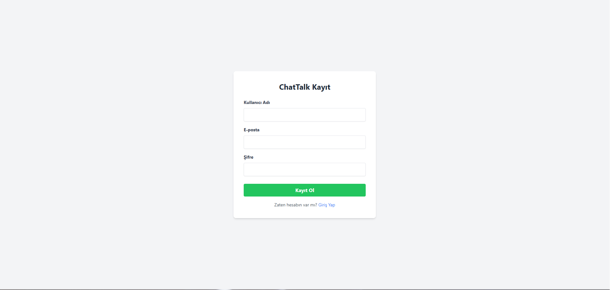
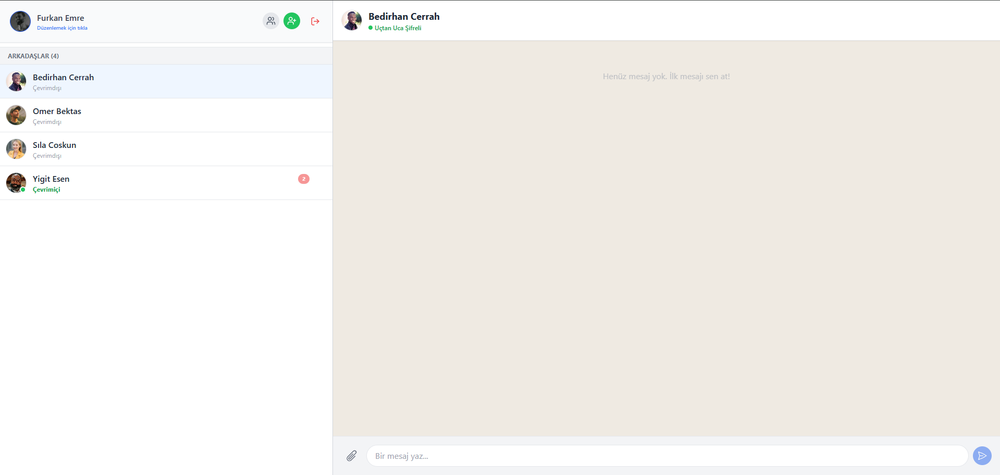
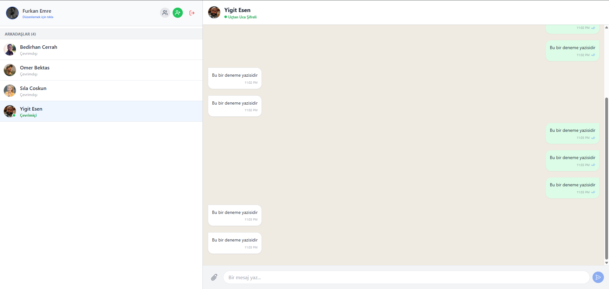

# ChatTalk - Secure & Real-Time Messaging Platform


**ChatTalk**, modern web teknolojileri kullanılarak geliştirilmiş, **Uçtan Uca Şifreli (E2EE)** ve gerçek zamanlı bir mesajlaşma uygulamasıdır.  
Proje; **Clean Code**, **Scalability (Ölçeklenebilirlik)** ve **DevOps** prensiplerine uygun, **production-grade** bir mimari sunar.

---

## Screenshots

| Login | Register |
| :---: | :---: |
|  |  |

### Chat Interface
| :---: | :---: |
 |  |

---

## Architecture Overview

Proje, **3-Tier Architecture** prensibine göre tasarlanmıştır:

1. **Presentation Tier** – React (Vite) + Nginx  
2. **Application Tier** – Node.js + Express + Socket.io  
3. **Data Tier** – MongoDB  

### System Architecture Diagram

```mermaid
graph TD
    Client[Client (React + Vite)] -->|HTTP/WebSocket| Nginx[Nginx (Reverse Proxy)]
    Nginx -->|/api| API[Node.js API Server]
    Nginx -->|/socket.io| API
    API -->|Read/Write| DB[(MongoDB)]
    
    subgraph Docker Network
        Nginx
        API
        DB
    end
```

### Backend Folder Structure

```text
server/
├── controllers/    # HTTP request / response
├── services/       # Business logic
├── models/         # Mongoose schemas
├── middlewares/    # Auth, security, validation
├── routes/         # API endpoints
└── utils/          # Helper functions
```

---

## Security Features

- **End-to-End Encryption (E2EE)**
- Rate Limiting (Login, Search, Messaging)
- Input Validation (Zod)
- Helmet & CORS
- MongoDB Sanitize (NoSQL Injection)
- Password Hashing (Bcrypt)

---

## DevOps & Performance

- Docker & Docker Compose
- Nginx Reverse Proxy
- Multi-Stage Docker Builds
- Production-ready setup

---

## Real-Time Features

- Socket.io based messaging
- Typing indicators
- Online / Offline status

---

## Tech Stack

| Layer | Technologies |
|-----|-------------|
| Frontend | React, Vite, TailwindCSS, Socket.io-Client, Axios |
| Backend | Node.js, Express, Socket.io, Mongoose, JWT |
| Database | MongoDB |
| DevOps | Docker, Docker Compose, Nginx |
| Security | Zod, Helmet, Morgan, Rate-Limit, Bcrypt |

---

## Roadmap & Future Improvements

- [ ] **Email Verification & Authentication:**  
  - Email-based verification codes to confirm real email ownership  
  - Secure mail delivery using SMTP (OAuth2 support)  
  - Prevent fake accounts & improve account security  

- [ ] **OAuth 2.0 Authentication:**  
  - Google OAuth login & registration  
  - Token-based identity federation  

- [ ] **Voice & Video Calls:** WebRTC-based real-time communication  
- [ ] **Group Chat Management:** Advanced group roles & permissions  
- [ ] **File Sharing:** Secure file upload (AWS S3 integration)  
- [ ] **Unit & Integration Tests:** Jest & Supertest test suites  
- [ ] **CI/CD Pipeline:** GitHub Actions for automated testing & deployment  

> This roadmap demonstrates the project’s scalability vision and long-term maintainability focus.

---

## Installation

### 1️⃣ Clone Repository

```bash
git clone https://github.com/KULLANICI_ADIN/ChatTalk.git
cd ChatTalk
```

### 2️⃣ Environment Variables

Create `.env` inside **server/**

```env
PORT=5000
MONGO_URI=mongodb://mongo:27017/chattalk
JWT_SECRET=super_secret_key
NODE_ENV=production
```

### 3️⃣ Run with Docker

```bash
docker-compose up --build
```

Open 👉 **http://localhost**

---

## 🤝 Contributing

1. Fork the repository  
2. Create your feature branch (`git checkout -b feature/AmazingFeature`)  
3. Commit changes (`git commit -m 'Add AmazingFeature'`)  
4. Push (`git push origin feature/AmazingFeature`)  
5. Open a Pull Request  

---

## 📬 Contact

Developed by **Furkan Emre Saygın**

- 🔗 [LinkedIn](https://www.linkedin.com/in/furkan-emre-saygin)
- 📧 [Email](mailto:furkanemresaygin@gmail.com)

---

## 📄 License

This project is licensed under the **MIT License**.
